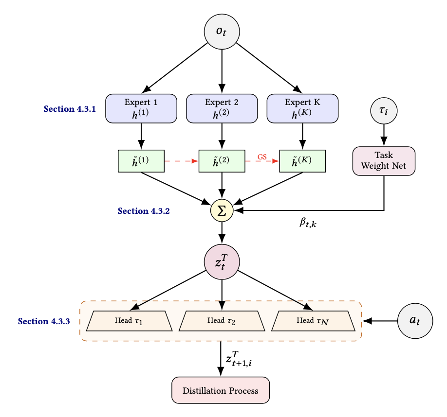
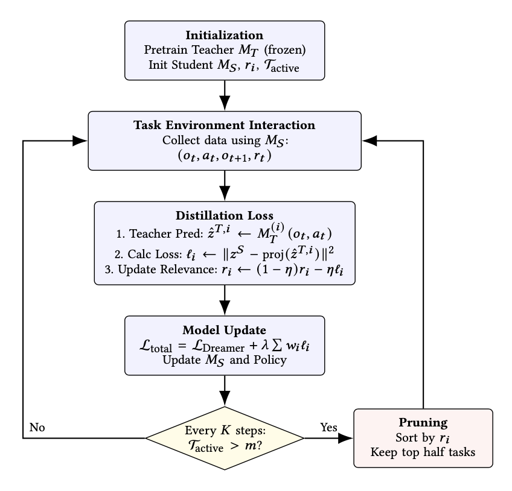

# COMET: Correlated tasks via Orthogonal experts and Multi-head world models for Efficient Teacher distillation

Official implementation of **COMET**. This framework leverages orthogonal experts and multi-head world models to improve the efficiency of teacher distillation across correlated tasks in reinforcement learning.

---

## 🛠 Installation

### 1. Clone the Repository

```bash
git clone https://github.com/ChenFengTsai/COMET.git
cd COMET

```

### 2. Create Environment

We recommend using Conda for environment management:

```bash
conda env create -f env.yaml
conda activate COMET
chmod +x install_all.sh # install Meta-World, RRL-Dependencies, mj_envs & mjrl
./install_all.sh

```

---

## 📂 Data Preparation

COMET uses offline datasets for teacher distillation and fine-tuning. Ensure your data is organized in the following structure to match the provided experiment commands:

### 1. Directory Structure
Create a `pretrain_data` directory (or point to your storage path) organized by benchmark:
```text
pretrain_data/
├── drawer-close-v2/
│   ├── trajectory_001.npz
│   ├── trajectory_002.npz
│   └── ...
├── door-open-v2/
│   ├── trajectory_001.npz
│   ├── trajectory_002.npz
│   └── ...
└── window-open-v2/
    └── trajectory_001.npz
```
---

## 🚀 Experiments

The COMET pipeline consists of three main stages: teacher pretraining, student distillation (or baseline training), and OOD detection.

### 1. Teacher Pretraining
First, pretrain the teacher model using a Mixture-of-Experts (MoE) configuration on the source tasks:

```bash
python dreamer_pretrain.py \
  --configs defaults metaworld metaworld_teacher_moe_pretrain \
  --logdir ./models/metaworld/teacher_moe \
  --device cuda:0 \
  --seed 0

```

### 2. Student Distillation

Use the pretrained teacher model to guide the student model on a target task.

**With Distillation (COMET):**

```bash
python dreamer_distill.py \
  --configs defaults metaworld \
  --logdir ./log/metaworld/{target_task}/distill \
  --teacher_model_path ./models/metaworld/teacher_moe/teacher_model.pt \
  --task metaworld_coffee_push \
  --teacher_encoder_mode moe \
  --device cuda:0 \
  --seed 0 \
  --use_distill True

```

**Without Distillation (Baseline):**
To run a standard training baseline without teacher guidance, set the `use_distill` flag to `False`:

```bash
python dreamer_distill.py \
  --configs defaults metaworld \
  --logdir ./log/metaworld/{target_task}/no_distill \
  --task metaworld_coffee_push \
  --device cuda:0 \
  --seed 0 \
  --use_distill False

```

### 3. Out-of-Distribution (OOD) Detection

To evaluate the statistical distance between the student's behavior on the target task and the teacher's source task distribution:

```bash
python ood_detection.py \
  --configs defaults metaworld metaworld_teacher_moe_pretrain \
  --student_dir ./log/metaworld/{target_task}/train_eps \
  --source_dir ./source_task_dirs \
  --teacher_model_path ./models/metaworld/teacher_moe/teacher_model.pt \
  --device cuda:0

```

---

## 📊 Methodology Overview

**COMET** (Correlated tasks via Orthogonal experts and Multi-head world models) is a task-consistent distillation framework designed to improve transfer robustness by disentangling representations within a teacher world model.

<table border="0">
  <tr>
    <td width="50%" align="center">
      
      <br>
      <b>(a) The COMET Architecture</b><br>
      <em>Observations are processed by orthogonal experts and aggregated via a gating network into task-specific heads.</em>
    </td>
    <td width="50%" align="center">
      
      <br>
      <b>(b) Training Pipeline</b><br>
      <em>The cycle illustrates the interaction, distillation, and the progressive pruning of source tasks.</em>
    </td>
  </tr>
</table>


### 🧠 Core Architectural Innovations
* **Orthogonalized Mixture-of-Experts (MoE) Encoder:** The teacher uses $K$ experts to map observations to features. To ensure expert diversity and reduce representation entanglement, COMET applies an **orthogonalization operator** (e.g., Gram-Schmidt) so that expert features remain distinct.
* **Multi-Head Latent Dynamics:** Instead of a single shared transition model, COMET utilizes separate dynamics heads. This isolates task-specific dynamics and prevents correlated transitions from contaminating the distillation signal.
* **Task-Conditioned Projection:** To align teacher and student latent spaces, COMET uses a decoupled task-conditioned projection. This ensures the student receives reliable dynamics information even when the target task is out-of-distribution (OOD).

### 📉 Efficient Distillation Mechanisms
* **Dynamics-Level Distillation:** COMET distills task-agnostic structural knowledge at the level of latent state transitions. By avoiding behavior replay or policy imitation, it remains robust under task mismatch.
* **Progressive Source-Task Pruning:** To scale efficiently, COMET tracks the relevance of each source task and periodically prunes the least informative heads. This maintains a fixed distillation cost regardless of the original source-task scale.
* **Reduced Negative Transfer:** By minimizing gradient interference during teacher pretraining, COMET produces more task-consistent signals. This leads to a clearer teacher latent belief and more effective knowledge transfer.

---

### Why COMET?
Empirical results on the Meta-World benchmark show that COMET consistently outperforms strong baselines like **Vid2Act** and **TD-MPC-Opt**. It demonstrates superior robustness on tasks that are highly dissimilar to the source distribution, such as **Coffee Push**, where it achieves significant performance gains by explicitly disentangling source-specific modes.

---

## 📜 Citation

If you find this work useful in your research, please cite:

---

## 🙏 Acknowledgements

This implementation is built upon or inspired by the following open-source projects:

* [dreamer-torch](https://github.com/jsikyoon/dreamer-torch) - A high-quality PyTorch implementation of the Dreamer agent.
* [Vid2Act](https://github.com/panmt/Vid2Act/tree/main) - Multi-task offline-to-online transfer learning via world model distillation.
* [TD-MPC-Opt](https://github.com/dmytro-kuzmenko/td-mpc-opt/tree/main) - Model-based reinforcement learning distillation for multi-task control.
* [MOORE](https://github.com/AhmedMagdyHendawy/MOORE/tree/main) - Multi-task reinforcement learning with a mixture of orthogonal experts.

---
